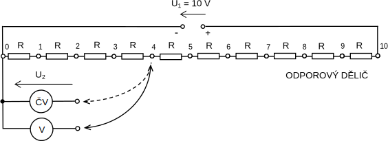

 

# 3. MĚŘENÍ NA NAPĚŤOVÉM DĚLIČI

## 3.1. Úkol měření

1. Změřte výstupní napětí $U_2$ děliče sestaveného z deseti rezistorů stejné jmenovité hodnoty pro všechny dělicí poměry $d$, a to:
   
   1. číslicovým voltmetrem
   2. magnetoelektrickým voltmetrem (na rozsahu $12V$).
   
   Do společného grafu vyneste závislosti $U_2 /U_1 = f(d)$ a vysvětlete jejich rozdíly. Velikost napájecího napětí děliče $U_1 = 10 V$.
   
2. Z naměřených hodnot vypočtěte výstupní odporděliče $R_D$ pro zadaný dělicí poměrd za předpokladu, že vstupní odpor číslicového voltmetru se blíží k nekonečnu.

3.  Vypočtěte **rozšířenou nejistotu typu B** (koeficient rozšíření $k_r = 2$), s jakou jste určili výstupní odpor děliče $R_D$ za předpokladu, že vnitřní odpor magnetoelektrického voltmetru je definován s tolerancí $0.2\%$.

## 3.2. Schéma zapojení

<figure>
  
  <figcaption>Obr. 3.1 Schéma zapojení</figcaption>
</figure>

## 3.3. Soupis použitých přístrojů

V     - voltmetr magnetoelektrický, tř.přes. $0.5$, rozsah $12 V$, odpor $500 \Omega/V$
ČV  - voltmetr číslicový, typ M1T 330, přesnost $\pm 0,01\%$ údaje $\pm 0,01\%$ rozsahu
U1  - zdroj stejnosměrného napětí, typ AGILENT E3640A
Př1 - odporový dělič

## 3.4. Teoretický základ

$$
U_1 = U_2
$$

$$
fbshbs
$$

$$

$$

