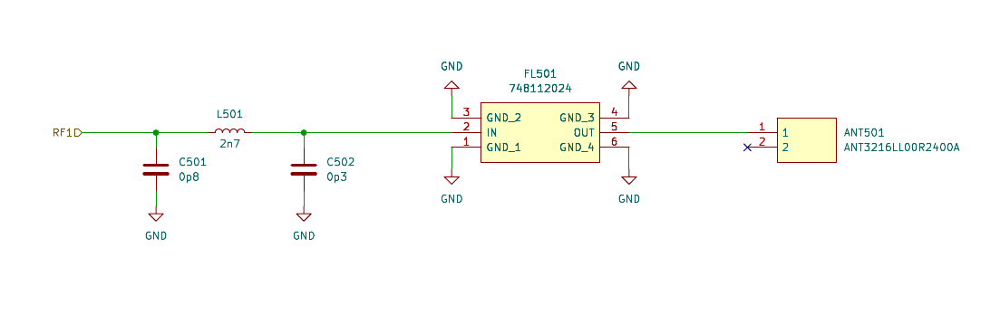

  ---
  marp: true
  theme: gaia
  ---

  # Zigbee

  Tomáš Kysela

  ---

# Zigbee

- Based on IEEE 802.15.4
- Low-power wireless mesh network
- 2.45 GHz (from 2007 also sub 1GHz)
- Similar to WiFi, Application layer is redefined

---

# Design

- 3 basic types of devices
  - Controller (ZC)
  - Router (ZR)
  - End Device (ZED)
- Module, SoC (TI CC2530Fxx), MCU (ST STM32WBx5)

---

# Comparison to Z-Wave, BT, Thread

| Param     | Zigbee                 | Z-Wave      | BT           | Thread                 |
|-----------|------------------------|-------------|--------------|------------------------|
| frequency | 2.45 GHz, 900 MHz   | 800 MHz     | 2.4&nbsp;GHz | 2.4 GHz                |
| release   | 2004 (2007)            | 1999        | 1998         | 2014                   |
| license   | Open, must be licensed | Proprietary | Open         | Open, must be licensed |
| Max speed | 250 (100) kbps          | 100 kbps    | 2 Mbps       | 250 kbps               |
| Range     | 30 (300) m             | 100-800 m   | 40 m         | 30 m                   |

---

# Usecase

- Home automation
- Industrial automation
- Medical devices
